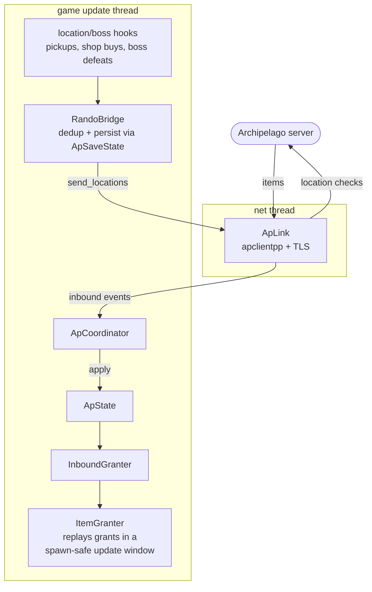

# Architecture

mth-apclient is an in-process mod for **Mina the Hollower** that acts as an
[Archipelago](https://archipelago.gg/) randomizer client. It loads into the running game, hooks a
handful of game functions, and bridges the game's item/location system to an Archipelago server.

The game runs on a custom engine (`yc`), rendering with Vulkan on Linux and Direct3D 12 on Windows.

## Targets

The build produces three layers with a strict dependency direction (`core` <- `pal` <- `mthap`):

| Target       | Kind       | Contents                                                                                                                                                                                                                       |
| ------------ | ---------- | ------------------------------------------------------------------------------------------------------------------------------------------------------------------------------------------------------------------------------ |
| `mthap_core` | static lib | Pure, cross-platform logic: AP state/coordinator, the location/item bridge, inbound granter, save state, ID mapping, startup config, enforcement policy, and the signature matcher. No OS/backend headers that require linking. **The unit tests link only this.** |
| `mthap_pal`  | object lib | The Platform Abstraction Layer: process entry points and the hook backend, under `src/pal/{linux,windows}/`. Built as an OBJECT library so loader-injected entry points are never dropped by the linker.                       |
| `mthap`      | module     | The final shared object (`mod.so` / `mod.dll`). The composition root (`mth::App`) wires `core` to `pal`.                                                                                                        |

`mth::App` owns the runtime. The logger and the hook engine are PAL globals exposed through
interfaces with injectable seams, so the core can be unit-tested without a real platform.

## Loading

|              | Linux                                     | Windows                                                 |
| ------------ | ----------------------------------------- | ------------------------------------------------------- |
| Binary       | `mod.so`                                  | `mod.dll`                                               |
| Manifest     | `mod.yc`                                  | `mod.yc`                                                |
| Mechanism    | Native game mod loader (modding beta)     | Native game mod loader (modding beta)                  |
| Entry point  | `MinaMod_Init(MinaModAPI*)`               | `MinaMod_Init(MinaModAPI*)`                             |
| Hook backend | Frida-Gum                                 | MinHook                                                 |

Both files (`mod.so`/`mod.dll` and `mod.yc`) belong in a per-mod folder under the game's mods
directory, which lives in its save dir (the SDL pref path). On Linux that is
`~/.local/share/Yacht Club Games/Mina the Hollower/mods/apclient/`. On Windows it is
`%APPDATA%\Yacht Club Games\Mina the Hollower\mods\apclient\`. Loading the code library requires
the `mod-allow-code` Steam launch option on the modding beta branch. The loader matches it as a
case-insensitive substring of the launch command line. There is no separate `-mod` switch. The
loader always runs and writes `mod.log` in that save dir.

## Resolving game functions

Hooks target specific game functions, resolved differently per platform behind a single PAL seam
(`pal::resolve_game_symbol`):

- **Linux**: As of Mina v1.0.6, the game binary is not stripped (it ships DWARF), so functions are
  resolved by their mangled symbol name via Frida's symbol table.
- **Windows**: the shipping PE is stripped, so functions are located by scanning the `.text`
  section for masked byte signatures. The pure matcher lives in `core` and is unit-tested. The
  signature table is produced by standalone tooling and validated against the shipping build.

The hook mechanisms and the signature-table workflow are documented in
[reverse-engineering.md](reverse-engineering.md).

## The Archipelago data flow



- **Outbound**: pickup hooks detect when a randomized location is collected, map it to an
  Archipelago location id, deduplicate against persisted state, and send it.
- **Inbound**: items received from the server are applied on the game thread by replaying the
  game's own item-grant path, in a window where spawning is safe.
- **Persistence**: checked locations and granted items are persisted per `(seed, slot)` so
  reconnects and reloads don't double-send or double-grant.
- The network stack (apclientpp / wswrap / websocketpp with OpenSSL) is an optional build feature.
  When it is not compiled in, a null link stands in.

Randomizer item/location data lives in [randomizer/](randomizer/).

## In-game overlay

An optional Dear ImGui dev console (toggle **F1**) renders over the game and offers commands to
connect, inspect status, and list items. It is implemented per platform but shares one
platform-agnostic console:

- **Linux**: hooks `vkQueuePresentKHR` for rendering and the SDL event path for input.
- **Windows**: hooks the DXGI swap-chain `Present` and the D3D12 command queue, with input via a
  window-procedure subclass.

## Linux runtime constraint

The mod is injected into the game's runtime, which may use an older glibc than the build host. If
the binary required glibc symbol versions newer than the runtime provides, the dynamic loader would
reject it before any of our code runs: no log, no game window. A post-build check
(`scripts/check-glibc-max.sh`) fails the build if any required glibc symbol exceeds the supported
floor. A small compatibility shim (`src/pal/linux/glibc_compat_linux.cpp`) pins or provides the
few symbols that would otherwise raise it.

## Repository layout

```
src/mth/core/     pure logic (test-linked)
src/mth/hooks/    per-feature game hooks (pickups/shop, bosses, locks, player tracking, item grants)
src/mth/net/      Archipelago link implementation
src/mth/ui/       dev console
src/pal/linux/    Linux PAL (Frida, Vulkan/SDL overlay, entry point)
src/pal/windows/  Windows PAL (MinHook, D3D12 overlay, native mod entry)
cmake/            dependency + toolchain modules
scripts/          build and signature tooling
tests/unit/       Catch2 unit tests
docs/randomizer/  randomizer item/location data
external/vcpkg/   vcpkg submodule
```
